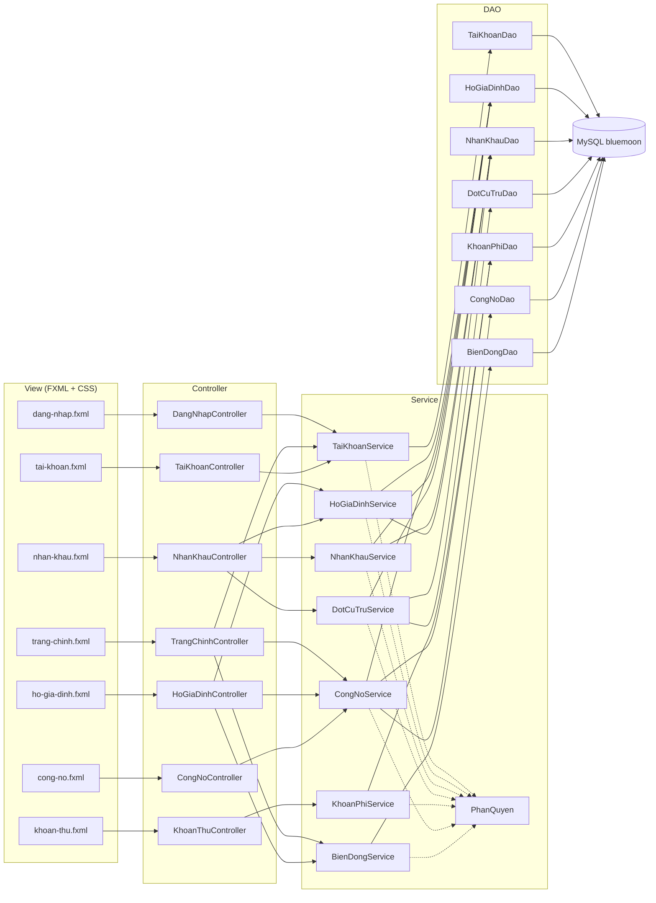
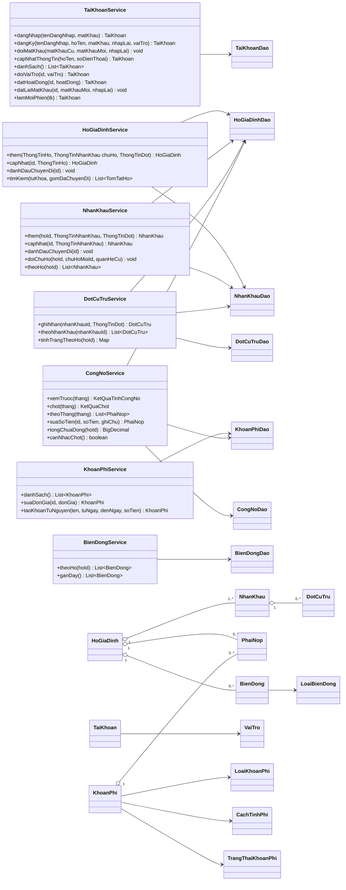

# Sơ đồ lớp

Mô tả các lớp trong `src/main/java/com/bluemoon` sau Sprint 2. Kiến trúc
phân tầng và bảng chức năng ↔ mã nguồn xem [architecture.md](architecture.md).

## Phân tầng và phụ thuộc

```mermaid
flowchart LR
    subgraph View["View (FXML + CSS)"]
        V1[dang-nhap.fxml]
        V2[trang-chinh.fxml]
        V3[ho-gia-dinh.fxml]
        V4[nhan-khau.fxml]
        V5[tai-khoan.fxml]
        V6[khoan-thu.fxml]
        V7[cong-no.fxml]
    end
    subgraph Controller
        C1[DangNhapController]
        C2[TrangChinhController]
        C3[HoGiaDinhController]
        C4[NhanKhauController]
        C5[TaiKhoanController]
        C6[KhoanThuController]
        C7[CongNoController]
    end
    subgraph Service
        S1[TaiKhoanService]
        S2[HoGiaDinhService]
        S3[NhanKhauService]
        S4[DotCuTruService]
        S5[KhoanPhiService]
        S6[CongNoService]
        S7[BienDongService]
        PQ[PhanQuyen]
    end
    subgraph DAO
        D1[TaiKhoanDao]
        D2[HoGiaDinhDao]
        D3[NhanKhauDao]
        D4[DotCuTruDao]
        D5[KhoanPhiDao]
        D6[CongNoDao]
        D7[BienDongDao]
    end
    DB[(MySQL bluemoon)]

    V1 --> C1 --> S1 --> D1
    V2 --> C2
    C2 --> S1
    C2 --> S6
    C2 --> S7
    V3 --> C3 --> S2 --> D2
    C3 --> S6
    C3 --> S7 --> D7
    V4 --> C4 --> S3 --> D3
    C4 --> S2
    C4 --> S4 --> D4
    V5 --> C5 --> S1
    V6 --> C6 --> S5 --> D5
    V7 --> C7 --> S6 --> D6
    S6 --> D5
    S6 --> D2
    S2 --> D3
    S3 --> D2
    S4 --> D2
    S4 --> D3
    S1 & S2 & S3 & S4 & S5 & S6 & S7 -.-> PQ
    D1 & D2 & D3 & D4 & D5 & D6 & D7 --> DB
```

DAO hộ gia đình, nhân khẩu, đợt tạm trú/tạm vắng ghi `bien_dong_nhan_khau`
trong cùng giao dịch (qua `BienDongDaoImpl.ghi`), nên `BienDongDao` chỉ có
hàm đọc.

## Lớp nghiệp vụ chính

Mọi hàm của Service nhận `TaiKhoan nguoi` (người đang đăng nhập) làm tham số
đầu và kiểm tra quyền bằng `PhanQuyen.yeuCau`; sơ đồ lược bỏ tham số này.
Ngoại lệ: `dangNhap`, `lamMoiPhien`, `thangHienTai` (xem
[architecture.md](architecture.md#phân-quyền)).

```mermaid
classDiagram
    direction LR

    class TaiKhoanService {
        +dangNhap(tenDangNhap, matKhau) TaiKhoan
        +dangKy(tenDangNhap, hoTen, matKhau, nhapLai, vaiTro) TaiKhoan
        +doiMatKhau(matKhauCu, matKhauMoi, nhapLai) void
        +capNhatThongTin(hoTen, soDienThoai) TaiKhoan
        +danhSach() List~TaiKhoan~
        +doiVaiTro(id, vaiTro) TaiKhoan
        +datHoatDong(id, hoatDong) TaiKhoan
        +datLaiMatKhau(id, matKhauMoi, nhapLai) void
        +lamMoiPhien(tk) TaiKhoan
    }
    class HoGiaDinhService {
        +them(ThongTinHo, ThongTinNhanKhau chuHo, ThongTinDot) HoGiaDinh
        +capNhat(id, ThongTinHo) HoGiaDinh
        +danhDauChuyenDi(id) void
        +timKiem(tuKhoa, gomDaChuyenDi) List~TomTatHo~
    }
    class NhanKhauService {
        +them(hoId, ThongTinNhanKhau, ThongTinDot) NhanKhau
        +capNhat(id, ThongTinNhanKhau) NhanKhau
        +danhDauChuyenDi(id) void
        +doiChuHo(hoId, chuHoMoiId, quanHeCu) void
        +theoHo(hoId) List~NhanKhau~
    }
    class DotCuTruService {
        +ghiNhan(nhanKhauId, ThongTinDot) DotCuTru
        +theoNhanKhau(nhanKhauId) List~DotCuTru~
        +tinhTrangTheoHo(hoId) Map
    }
    class KhoanPhiService {
        +danhSach() List~KhoanPhi~
        +suaDonGia(id, donGia) KhoanPhi
        +taoKhoanTuNguyen(ten, tuNgay, denNgay, soTien) KhoanPhi
    }
    class CongNoService {
        +xemTruoc(thang) KetQuaTinhCongNo
        +chot(thang) KetQuaChot
        +theoThang(thang) List~PhaiNop~
        +suaSoTien(id, soTien, ghiChu) PhaiNop
        +tongChuaDong(hoId) BigDecimal
        +canNhacChot() boolean
    }
    class BienDongService {
        +theoHo(hoId) List~BienDong~
        +ganDay() List~BienDong~
    }

    TaiKhoanService --> TaiKhoanDao
    HoGiaDinhService --> HoGiaDinhDao
    HoGiaDinhService --> NhanKhauDao
    NhanKhauService --> NhanKhauDao
    NhanKhauService --> HoGiaDinhDao
    DotCuTruService --> DotCuTruDao
    DotCuTruService --> NhanKhauDao
    DotCuTruService --> HoGiaDinhDao
    KhoanPhiService --> KhoanPhiDao
    CongNoService --> CongNoDao
    CongNoService --> KhoanPhiDao
    CongNoService --> HoGiaDinhDao
    BienDongService --> BienDongDao

    class TaiKhoan
    class HoGiaDinh
    class NhanKhau
    class DotCuTru
    class KhoanPhi
    class PhaiNop
    class BienDong
    HoGiaDinh "1" o-- "1..*" NhanKhau
    NhanKhau "1" o-- "0..*" DotCuTru
    HoGiaDinh "1" o-- "0..*" PhaiNop
    KhoanPhi "1" o-- "0..*" PhaiNop
    HoGiaDinh "1" o-- "0..*" BienDong
    TaiKhoan --> VaiTro
    KhoanPhi --> LoaiKhoanPhi
    KhoanPhi --> CachTinhPhi
    KhoanPhi --> TrangThaiKhoanPhi
    BienDong --> LoaiBienDong
```

Mỗi `XxxDao` là interface, có `XxxDaoImpl` cài bằng JDBC; test dùng DAO giả
trong bộ nhớ (`KhoGia`, `KhoThuPhiGia`).

## Ghi chú thiết kế

- Service nhận DAO qua constructor nên test dùng DAO giả trong bộ nhớ, không
  cần MySQL (xem `src/test/java/com/bluemoon/service`).
- `ThongTinHo`, `ThongTinNhanKhau`, `ThongTinDot` là dữ liệu nhập từ form,
  tách khỏi model để Service kiểm tra hợp lệ trước khi tạo model.
- `KiemTraNhanKhau` gom các quy tắc kiểm tra nhân khẩu dùng chung; `LoiTrung`
  đổi lỗi trùng khóa của CSDL (khi hai máy cùng lưu) thành thông báo nghiệp
  vụ; `SoTien` đọc và hiển thị số tiền kiểu Việt Nam.
- `PhanQuyen` kiểm tra vai trò ở Service (lớp thứ hai sau việc ẩn menu).
- `NghiepVuException`: lỗi nghiệp vụ hiển thị cho người dùng;
  `DaoException` (và lớp con `TrungKhoaException`): lỗi truy cập CSDL;
  `CauHinhException`: lỗi đọc `config/db.properties`.
- `PhienLamViec` giữ tài khoản đang đăng nhập; `DieuHuong` chuyển màn hình;
  `BangLichSu` dựng bảng lịch sử biến động dùng chung cho hai màn hình.
